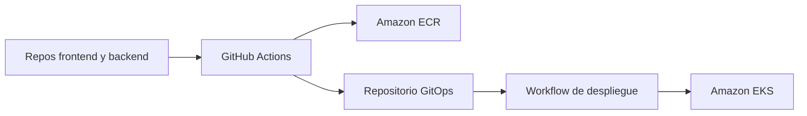

# Documentación de GitOps y DevOps

| Documento | Contenido |
| --- | --- |
| [Arquitectura](solution-architecture.md) | AWS, EKS, Kubernetes y acceso público |
| [Ambientes y Kustomize](environments-and-kustomize.md) | Base, overlays y promoción |
| [CI/CD](cicd.md) | Construcción, ECR, SHA y despliegue |
| [Seguridad y secretos](security-and-secrets.md) | OIDC, IAM, Secrets Manager y red |
| [Runbook de despliegue](deployment-runbook.md) | Aprovisionar, publicar, validar y revertir |
| [Operación y DR](operations-observability-dr.md) | Salud, logs, respaldo e incidentes |
| [Desarrollo local](local-development.md) | Docker Compose y validación |
| [Costos y retiro](costs-and-decommission.md) | Recursos cobrables y desmontaje seguro |

