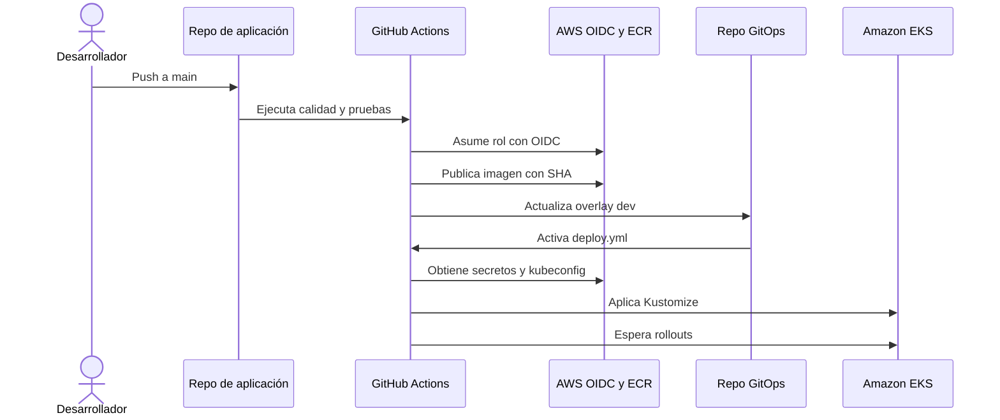
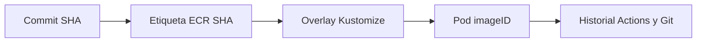

# CI/CD y GitOps

## Flujo completo



## Pipelines

| Workflow | Disparador | Resultado |
| --- | --- | --- |
| Frontend `ci-cd.yml` | Push/PR | Lint, TypeScript, build; en main imagen ECR y GitOps |
| Backend `ci-cd.yml` | Push/PR | Tests y auditoría; en main imagen ECR y GitOps |
| GitOps `deploy.yml` | Cambio de base/dev o manual | Secret, Ingress, overlay y rollouts |
| GitOps `promote.yml` | Manual | SHAs existentes a staging/prod y despliegue |
| GitOps `rotate-admin-password.yml` | Manual | Sincroniza secreto bootstrap AWS/Kubernetes |

## Trazabilidad



La etiqueta debe usar el SHA completo. Para ver el digest ejecutado:

```bash
kubectl -n ciberguate-dev get pods -o jsonpath="{range .items[*]}{.metadata.name}{' '}{.status.containerStatuses[*].imageID}{'\n'}{end}"
```

## Variables y secretos de GitHub

Variables habituales: `AWS_REGION`, `AWS_ACCOUNT_ID`, `EKS_CLUSTER_NAME`, repositorio ECR/GitOps e `INGRESS_SERVICE_TYPE`. Secretos: ARN del rol AWS y llave de despliegue GitOps cuando corresponda. Nunca use access keys AWS de larga duración.

## Fallos

- Una validación fallida detiene la publicación.
- Un push GitOps sólo ocurre después de publicar la imagen.
- `cancel-in-progress: false` serializa despliegues del mismo ambiente.
- Un rollout fallido deja el commit declarativo visible; investigue eventos y revierta a SHAs anteriores.

## Promoción controlada

Antes de staging/prod confirme pruebas, vulnerabilidades, digest disponible, backup reciente, ventana de cambio y plan de reversión. Registre los dos SHAs promovidos en la evidencia del cambio.
