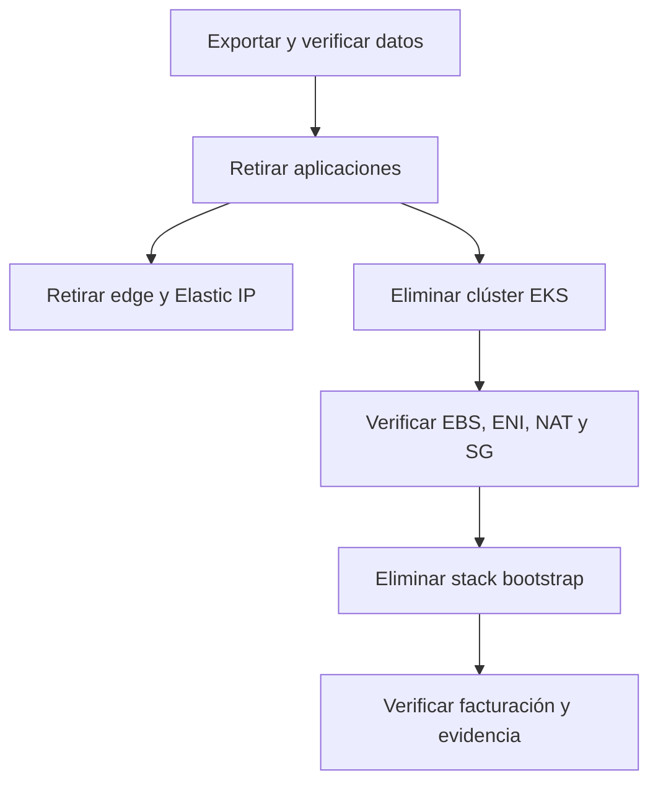

# Costos y desmontaje

## Recursos con costo

- Plano de control EKS y nodos EC2.
- NAT Gateway, transferencia y direcciones IPv4 públicas.
- Volúmenes/snapshots EBS.
- EC2 edge y Elastic IP.
- ECR, Secrets Manager, CloudWatch y S3 de respaldo.

Configure AWS Budgets y alertas antes de crear infraestructura. Los precios cambian; utilice AWS Pricing Calculator con región, horas, tráfico, almacenamiento y retención reales.

## Dependencias para desmontaje



## Procedimiento seguro

1. Aprobar ventana y retención legal.
2. Generar y restaurar de prueba el último backup.
3. Conservar SHAs, configuración no sensible y evidencia de auditoría.
4. Retirar tráfico y confirmar que no hay usuarios activos.
5. Eliminar el stack perimetral para liberar EC2/EIP/reglas.
6. Eliminar EKS con el mismo archivo eksctl y esperar terminación completa.
7. Comprobar recursos huérfanos: load balancers, NAT, ENI, EBS, snapshots, IP y security groups.
8. Eliminar repositorios ECR/secretos sólo después de cumplir la retención.
9. Eliminar el stack bootstrap y revisar Cost Explorer en días posteriores.

```bash
eksctl delete cluster -f infrastructure/eksctl/cluster.yaml
```

La eliminación de bases, backups, secretos o repositorios ECR es irreversible; valide identificadores y política de conservación antes de ejecutarla.
