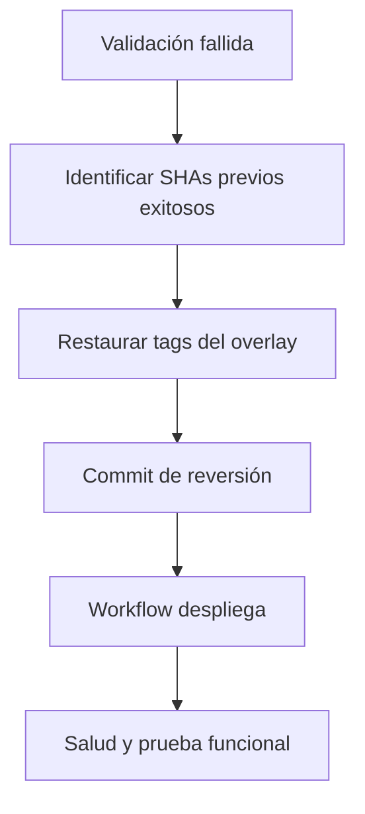

# Runbook de despliegue

## 1. Prerrequisitos

- AWS CLI y sesión válida con permisos para CloudFormation/EKS/IAM.
- `eksctl`, Helm y `kubectl` en la estación operadora; GitHub Actions ya incluye sus herramientas en el runner.
- Cuenta/región, VPC y presupuesto confirmados.
- Variables y secretos GitHub configurados.

## 2. Bootstrap AWS

```powershell
aws cloudformation deploy `
  --stack-name ciberguate-bootstrap `
  --template-file infrastructure/aws/bootstrap.yaml `
  --capabilities CAPABILITY_NAMED_IAM `
  --region us-east-1
```

Registre los outputs de roles y URIs ECR sin copiar valores secretos.

## 3. Crear EKS

```bash
eksctl create cluster -f infrastructure/eksctl/cluster.yaml
aws eks update-kubeconfig --name ciberguate-eks --region us-east-1
kubectl get nodes
```

## 4. Entrada pública transitoria

Obtenga VPC, subnet pública y security group de nodos; despliegue `public-edge.yaml` con esos parámetros. Confirme que sólo la security group del edge alcanza el NodePort. El certificado se emite para `<ElasticIP>.nip.io`.

## 5. Primer despliegue

1. Publicar al menos una imagen frontend/backend en ECR.
2. Colocar sus SHAs completos en `overlays/dev/kustomization.yaml`.
3. Ejecutar `Deploy to EKS` para `dev`.
4. El workflow instala/actualiza ingress-nginx, materializa secretos, aplica Kustomize y espera rollouts.

## 6. Validación

```bash
kubectl -n ciberguate-dev get pods,svc,ingress,pvc
kubectl -n ciberguate-dev rollout status statefulset/postgres
kubectl -n ciberguate-dev rollout status deployment/backend
kubectl -n ciberguate-dev rollout status deployment/frontend
curl -fsS https://100.49.206.62.nip.io/health
```

## 7. Reversión



La reversión de aplicación no revierte cambios destructivos de datos. Para un cambio de esquema incompatible restaure backup o ejecute una migración inversa probada.

## 8. Promoción

Ejecute `Promote image SHAs`, seleccione staging/prod y proporcione los SHAs ya verificados. No promueva una etiqueta reconstruida.

## Diagnóstico rápido

| Síntoma | Comprobación |
| --- | --- |
| `ImagePullBackOff` | URI/tag ECR, rol del nodo y existencia del digest |
| `CrashLoopBackOff` backend | Logs, `DATABASE_URL`, JWT y salud PostgreSQL |
| PostgreSQL pendiente | PVC, EBS CSI, zona y eventos del pod |
| 502/504 | Endpoints de Services, readiness y NetworkPolicy |
| Certificado inválido | DNS nip.io, puertos 80/443, logs Certbot y fecha del sistema |
| Workflow sin acceso | Claims OIDC, trust policy, ARN y permisos EKS |
