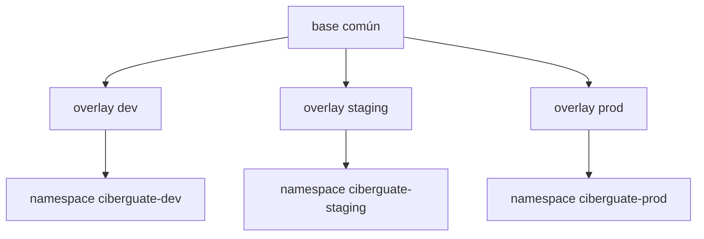

# Ambientes y Kustomize

## Herencia



| Ambiente | Réplicas de aplicación | Actualización | Extras |
| --- | ---: | --- | --- |
| dev | 1 | Automática desde repos de aplicación | Validación continua |
| staging | 2 | Promoción manual de SHAs | Host específico |
| prod | 3 | Promoción manual de SHAs | Host y PodDisruptionBudget |

## Composición

`base/kustomization.yaml` incluye workloads, servicios, Ingress, políticas de red y un ConfigMap. Cada overlay define namespace, imágenes inmutables, réplicas y parches propios.

```bash
kubectl kustomize overlays/dev
kubectl diff -k overlays/dev
kubectl apply -k overlays/dev
```

Si `kubectl` no está instalado, use `kustomize build overlays/dev` o deje la aplicación al workflow de GitHub Actions. La validación renderizada no requiere acceso al clúster.

## Regla de imágenes

```yaml
images:
  - name: ciberguate-frontend
    newName: <cuenta>.dkr.ecr.<region>.amazonaws.com/ciberguate-frontend
    newTag: <sha-completo>
```

No edite `base` para cambiar una versión por ambiente. `scripts/update-image.mjs` actualiza exclusivamente la entrada de imagen correspondiente.

## Promoción

Promover significa reutilizar los mismos digests construidos y probados en dev, indicando los SHAs completos en `promote.yml`. No se recompila código durante promoción.

## Configuración y secretos

- Configuración no sensible: `ConfigMap` del base y parches de overlay.
- Credenciales: Secrets Manager, materializadas como `ciberguate-secrets` antes del `kubectl apply`.
- `base/secret.template.yaml` sólo describe las claves y está excluido de Kustomize.
