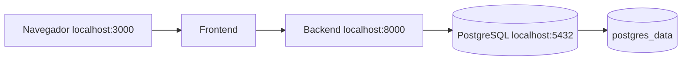

# Desarrollo local con Docker Compose

## Topología



La estructura esperada coloca `FrontEnd`, `BackEnd` y `DevOps` como carpetas hermanas.

```bash
cd DevOps
docker compose build
docker compose up -d
docker compose ps
```

Validación:

```bash
curl http://localhost:8000/health
docker compose logs --tail=100 backend
```

Para detener sin eliminar datos:

```bash
docker compose down
```

Eliminar el volumen borra la base local y sólo debe hacerse cuando se busca reinicializar deliberadamente:

```bash
docker compose down --volumes
```

## Variables locales

`POSTGRES_PASSWORD`, `OPENAI_API_KEY`, `OPENAI_MODEL` y variables OIDC pueden definirse en un `.env` no versionado. Los valores por defecto son sólo para desarrollo local.

## Diferencias respecto a AWS

| Local | AWS/EKS |
| --- | --- |
| Imágenes construidas desde carpetas hermanas | Imágenes inmutables desde ECR |
| Volumen Docker | PVC EBS |
| Variables `.env` | Secrets Manager y Kubernetes Secret |
| Puertos localhost | Ingress HTTPS y borde público |
| Una instancia por servicio | Réplicas según overlay |

Antes de un commit valide también los tres overlays Kustomize y las pruebas de cada aplicación.
