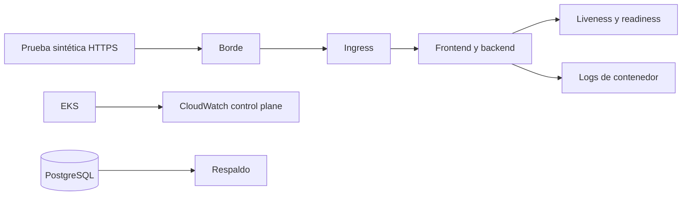
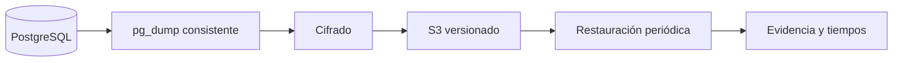

# Operación, observabilidad y recuperación

## Señales operativas



| Capa | Validación mínima | Alerta sugerida |
| --- | --- | --- |
| Sitio público | HTTPS, login y flujo funcional | Dos fallos consecutivos |
| Edge/Ingress | 4xx/5xx, certificado y latencia | 5xx o expiración próxima |
| Pods | Ready, reinicios, CPU/memoria | No disponible o reinicios crecientes |
| Backend | `/health`, errores y latencia | Salud fallida o p95 elevada |
| PostgreSQL | conexión, PVC y capacidad | espacio bajo, fallo de backup |
| EKS | API/audit/authenticator logs | acceso anómalo o error del control plane |

## Comandos de operación

```bash
kubectl -n ciberguate-dev get pods -o wide
kubectl -n ciberguate-dev get events --sort-by=.lastTimestamp
kubectl -n ciberguate-dev logs deployment/backend --since=30m
kubectl -n ciberguate-dev describe ingress ciberguate
kubectl top nodes
kubectl top pods -A
```

No copie secretos en tickets o logs. Redacte JWT, correos sensibles, IP y payloads según la política de privacidad.

## Respaldo y restauración

El PVC no es un backup. Para el MVP, programe `pg_dump` cifrado hacia un bucket S3 con versionado, lifecycle y acceso restringido; pruebe la restauración en un namespace aislado.



Objetivos iniciales recomendados para el MVP, sujetos a aprobación del negocio: RPO 24 horas y RTO 4 horas. Producción crítica requiere RDS, backups administrados, Multi-AZ y objetivos más estrictos.

## Incidente operativo

1. Declarar severidad, responsable y canal.
2. Preservar logs, eventos, SHA/digest y auditoría.
3. Contener sin eliminar evidencia.
4. Revertir aplicación o aislar componente afectado.
5. Restaurar datos sólo desde un backup verificado.
6. Validar salud y casos de uso críticos.
7. Documentar causa, impacto, tiempo y acciones preventivas.

## Recuperación ante desastre

Orden: red/IAM → EKS/add-ons → Secrets Manager → Ingress → PostgreSQL/PVC → restauración DB → backend → frontend → DNS/TLS → pruebas. Las imágenes por SHA permanecen en ECR; configure retención para no eliminar las versiones exigidas por el plan de DR.

## Mantenimiento

- Revisar versiones EKS y add-ons antes de fin de soporte.
- Renovación TLS automática, con alerta externa previa a expiración.
- Probar promoción/reversión y restore trimestralmente.
- Revisar capacidad, costos, auditoría IAM y vulnerabilidades de imagen mensualmente.
