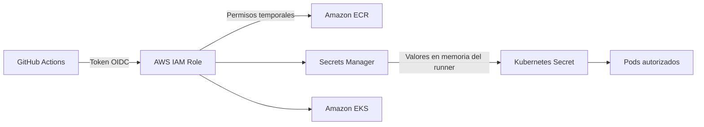
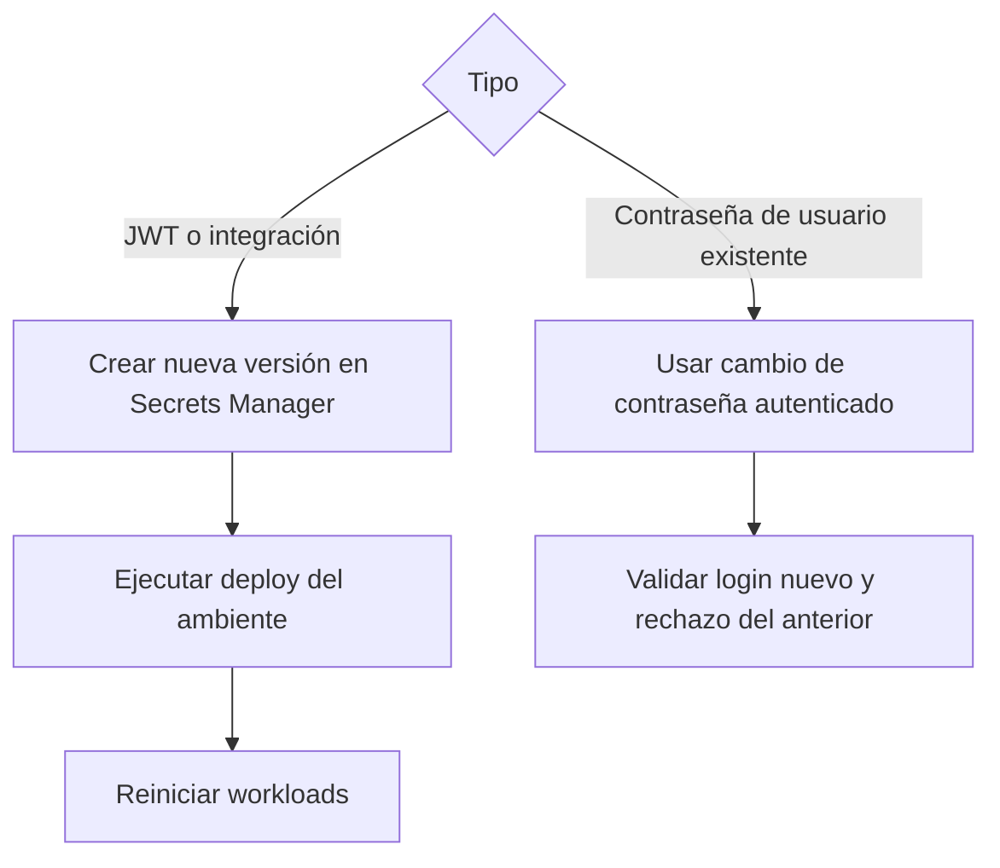
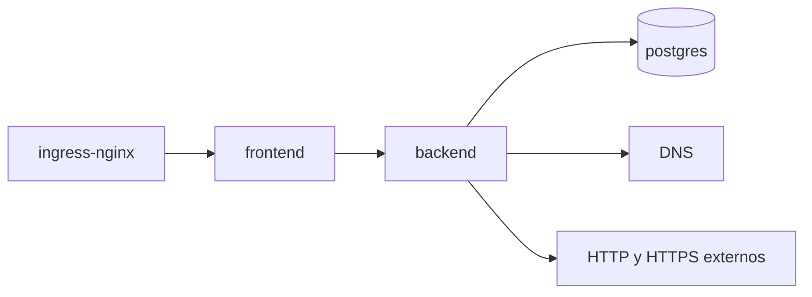

# Seguridad, identidad y secretos

## Cadena de confianza

`bootstrap.yaml` crea ECR inmutable, proveedor OIDC, roles de build/deploy y secretos separados por ambiente. Revise condiciones de repositorio/rama en la confianza IAM antes de reutilizar la plantilla en otra organización.

## Contrato de secretos

| Secret de AWS | Claves |
| --- | --- |
| `ciberguate/<env>/database` | `POSTGRES_DB`, `POSTGRES_USER`, `POSTGRES_PASSWORD` |
| `ciberguate/<env>/auth-admin` | `ADMIN_EMAIL`, `ADMIN_PASSWORD` |
| `ciberguate/<env>/auth-signing` | `JWT_SECRET` |
| `ciberguate/<env>/integrations` | `OPENAI_API_KEY`, `OIDC_CLIENT_SECRET` opcionales |

El workflow crea `ciberguate-secrets` mediante `--from-literal` canalizado directamente a `kubectl apply`; los valores no se escriben en Git. Evite activar trazas de shell que puedan imprimirlos.

## Rotación

Importante: `ADMIN_PASSWORD` es una credencial de bootstrap; el backend sólo crea el administrador si no existe. Cambiar únicamente Secrets Manager o Kubernetes no modifica el hash de un usuario ya persistido. Para una cuenta existente use `POST /api/v1/auth/change-password`; después sincronice el secreto de recuperación/bootstrap si la política operacional lo requiere. El workflow de rotación no reemplaza ese cambio en base de datos.

## Red de confianza cero

NetworkPolicy limita los flujos indicados. El egress HTTP/HTTPS del backend es necesario para scanner, OIDC y OpenAI, pero debe complementarse con proxy/allowlist en un entorno de alta seguridad.

## Controles pendientes para producción crítica

- Cifrado de Kubernetes Secrets mediante KMS y External Secrets/Secrets Store CSI.
- RDS Multi-AZ con credenciales rotables en lugar de PostgreSQL dentro del clúster.
- AWS WAF, balanceador administrado, rate limiting y protección DDoS.
- Escaneo de imágenes, firma con cosign y política de admisión por digest.
- RBAC Kubernetes dedicado por workflow y separación de cuentas AWS por ambiente.
- Alertas de CloudTrail, GuardDuty, Security Hub y exportación de auditoría.
