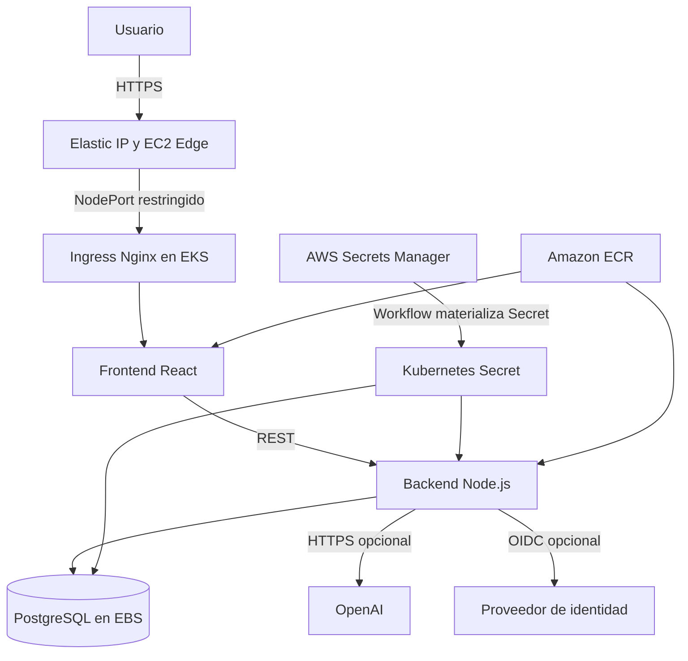
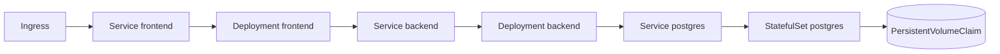

# Arquitectura de solución

## Vista de despliegue

## Componentes AWS

| Componente | Propósito |
| --- | --- |
| EKS | Plano de control administrado para cargas Kubernetes |
| Node group privado | Ejecutar pods sin IP pública directa |
| ECR | Repositorios inmutables de frontend y backend |
| Secrets Manager | Fuente externa de credenciales por ambiente |
| IAM + GitHub OIDC | Credenciales temporales de CI/CD sin access keys persistentes |
| CloudWatch | Logs de API, auditoría y autenticador de EKS |
| EBS CSI | Volumen persistente de PostgreSQL |
| EC2 Edge + EIP | Entrada estable mientras ELB está restringido |

## Arquitectura Kubernetes

Cada ambiente usa un namespace `ciberguate-<ambiente>`. NetworkPolicy limita PostgreSQL al backend, frontend al Ingress y backend a frontend; el backend conserva salida DNS, HTTP y HTTPS para diagnóstico e integraciones.

## Acceso público

El stack `public-edge.yaml` instala Nginx y Certbot en una EC2 `t3.micro`, asocia una Elastic IP y permite al borde alcanzar el NodePort del Ingress. Es un diseño transitorio motivado por la restricción de ELB de la cuenta. Cuando ELB esté habilitado, use un NLB/ALB administrado y retire el edge siguiendo el runbook de desmontaje.

## Supuestos

- Región `us-east-1` y clúster `ciberguate-eks`, salvo parametrización explícita.
- Los nodos privados tienen salida a ECR, AWS APIs e Internet mediante la red aprovisionada por eksctl.
- PostgreSQL dentro del clúster es suficiente para el MVP; producción crítica debería evaluar Amazon RDS Multi-AZ.
